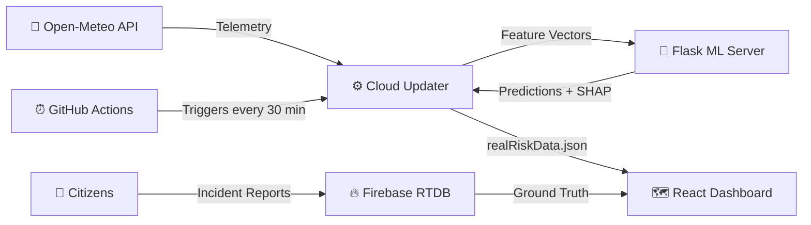

<div align="center">

# 🏔️ BHUMI

### Boundary Hazard & Unstable terrain Monitoring Intelligence

**A comprehensive, automated landslide early warning system built for the vulnerable terrains of Sikkim.**

By combining real-time satellite telemetry, machine learning, and explainable AI, BHUMI predicts landslide susceptibility at a highly localized grid level. The system operates on a zero-maintenance serverless pipeline that ensures decision-makers have access to the most current risk data through an interactive geospatial dashboard.

</div>

---

## Tech Stack

<table>
  <tr>
    <th>Layer</th>
    <th>Technologies</th>
  </tr>
  <tr>
    <td><strong>Frontend</strong></td>
    <td>
      
      
      
      
    </td>
  </tr>
  <tr>
    <td><strong>Backend</strong></td>
    <td>
      
      
      
      
    </td>
  </tr>
  <tr>
    <td><strong>Data & ML</strong></td>
    <td>
      
      
      
    </td>
  </tr>
  <tr>
    <td><strong>Infrastructure</strong></td>
    <td>
      
      
      
    </td>
  </tr>
</table>

---

## Key Features

| Feature | Description |
|---------|-------------|
| 🗺️ **Interactive Geospatial Dashboard** | A responsive, map-based interface built with React and Leaflet. Click any localized grid cell across Sikkim to reveal specific risk factors including 3-day rainfall, slope angle, and fault-line proximity. |
| 🌡️ **Risk Heatmaps** | Dynamic visual heatmaps highlighting high-probability landslide clusters for rapid geographical assessment. |
| 🔐 **Role-Based Access Control** | Dedicated portals tailored for Citizens, Government Officials, and Data Analysts. |
| ⚡ **Instant Load Times** | Runs entirely from a pre-calculated JSON state, handling high traffic during critical emergencies without straining a live database. |
| 🌐 **Multilingual Support** | Interface and critical alerts available in multiple regional languages for maximum accessibility. |
| 🧠 **Explainable AI (XAI) Risk Factors** | Transparent reasoning for every prediction, explicitly breaking down which environmental factors drive the risk level. |
| 🌀 **Landslide Simulation** | Model hypothetical weather scenarios and visualize potential disaster impacts before they occur. |
| 📢 **Citizen Incident Reporting** | Crowdsourced ground-truth data via Firebase RTDB, enabling real-time reports of active landslides and infrastructural damage. |
| 📡 **Automated Telemetry Ingestion** | Autonomously fetches live weather, soil moisture, temperature, and humidity data from the Open-Meteo Global API. |
| 🔄 **Fully Automated Pipeline** | GitOps-based orchestration triggers updates every 30 minutes, runs ML inference, and deploys fresh data automatically. |
| 🛡️ **High Availability Fallback** | Graceful degradation to a deterministic Sigmoid Risk Formula if the ML backend experiences downtime. |

---

## Architecture

The architecture is split into three core pillars:



| Pillar | Stack | Purpose |
|--------|-------|---------|
| **Frontend Visualization** | React, Vite, React Leaflet | Interactive geospatial dashboard |
| **Backend API** | Flask, scikit-learn, SHAP | ML model serving & explainability |
| **Automation Engine** | GitHub Actions, Cloud Updater | Serverless pipeline orchestration |

---

## 🚀 Getting Started

### Prerequisites

| Requirement | Version |
|-------------|---------|
|  | `3.11+` |
|  | `v20+` |

### Frontend Setup

Create a `.env` file inside `FRONTEND/` with the following variable:

```env
VITE_FIREBASE_DB_URL=<your-firebase-realtime-database-url>
```

Then install and run:

```bash
cd FRONTEND
npm install
npm run dev
```

> The application will be accessible at **http://localhost:5173**

### Backend Setup

```bash
cd BACKEND
pip install -r requirements.txt
python app.py
```

> The server will start on **http://localhost:5000**

> [NOTE]
> The backend must be running before executing the cloud updater script, which calls the `/predict/batch` endpoint to score all grid cells. If the backend is not running, the updater will fall back to the legacy sigmoid formula and log a warning.

---

## Machine Learning Model

| Property | Details |
|----------|---------|
| **Model File** | `sikkim_landslide_model.joblib` |
| **Algorithm** | scikit-learn `RandomForestClassifier` |
| **Input Features (6)** | `rainfall_mm`, `soil_moisture`, `slope_degree`, `elevation_m`, `temperature_c`, `humidity` |
| **Output** | Binary probability - class `1` indicates landslide susceptibility |

---

## API Reference

### `GET /health`

Returns the health status of the API and verifies if the model is loaded in memory.

```json
{
  "status": "ok",
  "model_loaded": true
}
```

---

### `POST /predict`

Scores a single grid cell based on provided telemetry.

<details>
<summary>📥 Request Body</summary>

```json
{
  "rainfall_mm": 80,
  "soil_moisture": 60,
  "slope_degree": 30,
  "elevation_m": 2000,
  "temperature_c": 15,
  "humidity": 75
}
```

</details>

<details>
<summary>📤 Response Body</summary>

```json
{
  "risk_probability": 0.7234,
  "risk_percentage": 72.34,
  "risk_level": "SEVERE",
  "inputs_used": { }
}
```

</details>

---

### `POST /predict/batch`

Batch prediction optimized for scoring the entire state grid simultaneously. Accepts a JSON array of feature dictionaries and returns predictions with calculated SHAP values for explainability.

<details>
<summary>📥 Request Body</summary>

```json
[
  {"rainfall_mm": 80, "soil_moisture": 60, "slope_degree": 30, "elevation_m": 2000, "temperature_c": 15, "humidity": 75},
  {"rainfall_mm": 10, "soil_moisture": 30, "slope_degree": 5, "elevation_m": 4000, "temperature_c": 8, "humidity": 50}
]
```

</details>

<details>
<summary>📤 Response Body</summary>

```json
[
  {"risk_probability": 0.7234, "risk_percentage": 72.34, "risk_level": "SEVERE", "shap_values": {}},
  {"risk_probability": 0.0812, "risk_percentage": 8.12, "risk_level": "LOW", "shap_values": {}}
]
```

</details>

---

## Automated Pipeline: 30min Radar

The `30min_landslide_radar.yml` GitHub Action orchestrates the entire system:

```
┌─────────────────────────────────────────────────────────┐
│  ⏰  Cron Trigger (every 30 minutes)                    │
│    ↓                                                    │
│  📡  Fetch live telemetry from Open-Meteo API           │
│    ↓                                                    │
│  🧠  Hit /predict/batch → ML inference on all grids     │
│    ↓                                                    │
│  📊  Update realRiskData.json with predictions + SHAP   │
│    ↓                                                    │
│  🏗️  Build Vite frontend with fresh data                │
│    ↓                                                    │
│  🚀  Commit & deploy to keep live site up to date       │
└─────────────────────────────────────────────────────────┘
```

---

## Contributors

- [Arya Chavan](https://github.com/ryachavan)
- [Ojas Manjrekar](https://github.com/ojasm18)
- [Tanush Chavan](https://github.com/TanushCode)
- [Joel Wilson](https://github.com/InfiniteSkiller)
